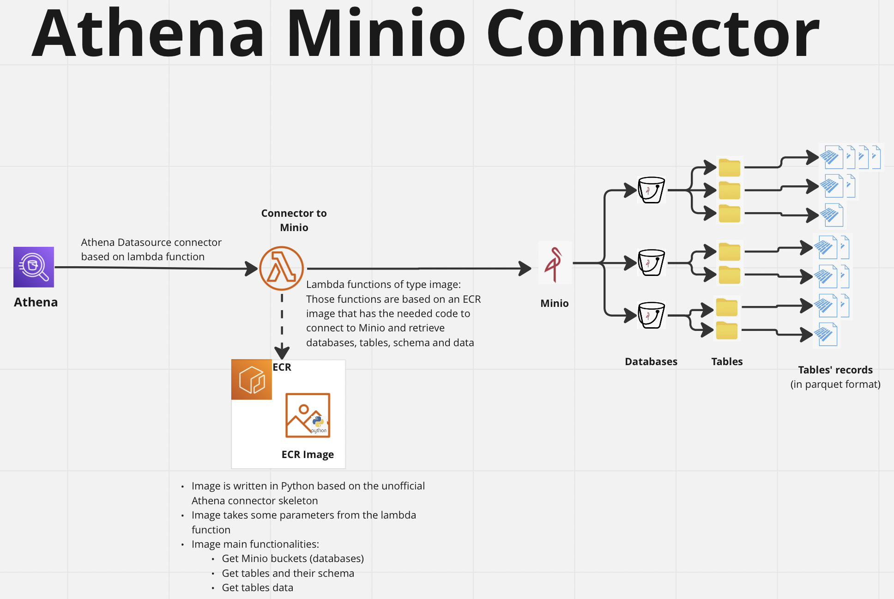

# athena-connector-for-minio
Athena Data Source Connector for Minio

## Overview

[Minio](https://min.io) is an open source project under GNU AGPL v3.0. It is compatible with Amazon S3 object store and can handle structured and unstructured data. It can be deployed on-premises or on the cloud.  
This example shows how parquet data stored in Minio buckets can be queried via Amazon Athena. 
The example uses the [Unofficial Athena Query Federation Python SDK](https://github.com/dacort/athena-federation-python-sdk/) to do the following:
 


An Athena Data source connector will point to a lambda function.  
The lambda function is of type image and will point to an ECR image.  
The function code is responsible of connecting to Minio and retrieving Minio buckets data.
The code tries to imitate the behaviour of Athena with S3 buckets:   
Each bucket is a database, each folder inside the bucket is a table and all parquet files inside each folder represent the table's data.  

To note that this documentation explains the steps needed to implement the code provided in this repository. The code is just an example of how to connect Athena to Minio. The code can be modified based on need.

## Pre-requisites    
 
### Bug Fix in Parent Repository
The code of this repo relies on version 10.0.1 of pyarrow library and requires this [fix](https://github.com/dacort/athena-federation-python-sdk/pull/13/files#diff-fa602a8a75dc9dcc92261bac5f533c2a85e34fcceaff63b3a3a81d9acde2fc52).

### Secrets

- A secret should be created to hold Minio credentials. The secret can be placed in any provider's vault. 
- In this example, we will be using AWS Secrets Manager to store the secret. All the following documentation assumes that AWS Secrets Manager is the place that holds the secret.
- The secret should have the following key/value pairs:  
  - access_key: username used to login to Minio
  - secret_key: Minio username's password
  - server: Minio endpoint
- The secret should be stored in the same region of the lambda connector 
- The username provided in the secret should have read access to Minio buckets required for Athena
- In case the secret is stored in a different provider's vault, the following adjustments should be made to the code: 
  - The f_get_secret function code in handler.py file should be updated to connect to the secret's provider 
  - The return value of f_get_secret should be a dictionary holding the security elements described above

## Content

### Lambda Function

- The lambda function points to an image in ECR
- The lambda function needs to have internet access to connect to Minio. Therefore, it should be placed in a VPC that has route to the internet.
- The IAM role attached to the lambda function should have access to the following:
  - the Athena spill S3 bucket (read/write)
  - the secret created in the pre-requisites section (read)
  - AWSLambdaVPCAccessExecutionRole
- The lambda function should be placed in the same region as the secret created in the pre-requisites section (Otherwise some changes should be done to the code)
- Lambda environment variables:
  - AWS_SECRET : should hold the secret name of the secret created in the pre-requisites section
  - TARGET_BUCKET: this is Athena spill bucket name
  - BUCKET_PREFIX: the prefix of buckets needed to be treated as databases. For example if BUCKET_PREFIX = minio_db_, then all Minio buckets with names starting with minio_db_ will be treated as databases and will be returned by the function
  - TABLES_PATH: the path to folders to be treated as tables. For example, if TABLES_PATH = Folder1/Folder2/Folder3, then all folders of buckets specified in BUCKET_PREFIX and belonging to the path specified in TABLES_PATH will be considered as tables. To note that tables should have parquet data for the code to run without errors
  - SCHEME : http or https based on the Minio endpoint type

### Docker Image 

A skeleton of a docker image was downloaded from [Unofficial Athena Query Federation Python SDK](https://github.com/dacort/athena-federation-python-sdk/) 
The content of <u>**example**</u> folder of the athena-federation-python-sdk repository should be replaced with the content of <u>**src**</u> folder of the current repository.
The src repository has 2 files:
- handler.py: this is the code that gets fired upon the execution of the lambda function. The code calls the AthenaLambdaHandler class with MinioDataSource as data source
- minio_data_source.py: This file holds the code of MinioDataSource class and all the logic needed to connect to Minio and retrieve databases, schema, tables, columns and data:
    - databases: this function returns the minio bucket(s) that start with the BUCKET_PREFIX prefix
    - tables: returns folders inside the database specified in the previous step the belong to the path TABLES_PATH
    - columns: returns column names of tables detected in the previous steps
    - schema: returns the schema of tables including column names and columns data types
    - records: returns records of tables

The docker image should be placed in AWS ECR.

## Implementation
Implemention steps are very similar to the ones described in [athena-federation-python-sdk](https://github.com/dacort/athena-federation-python-sdk#creating-your-lambda-function) repository:  

### Docker Image Build and Deployment to AWS

1. Build the docker image
2. Create a repository in ECR
3. Deploy the docker image to that repository

### Lambda IAM Role
1. Create an IAM role for the lambda function and assign to it policies as per the initial document
2. A policy should be created to give the role access to the secret holding Minio credentials


```shell
aws iam create-policy --policy-name athena-example-secret-manager-access --policy-document '{
  "Version": "2012-10-17",
  "Statement": [
    {
      "Effect": "Allow",
      "Action": ["secretsmanager:GetSecretValue" ],
      "Resource": ["secretsmanager:*:secret:'${secret name}'*"] 
    } 
  ]
}'
aws iam attach-role-policy \
    --role-name ${role name} \
    --policy-arn arn:aws:iam::${AWS_ACCOUNT_ID}:policy/athena-example-secret-manager-access
```

### Lambda
This is an example of the function creation
```shell
    aws lambda create-function \
    --function-name athena-minio-connector \
    --role arn:aws:iam::< AWS_ACCOUNT_ID >:role/${role name}  \
    --code ImageUri= < AWS_ACCOUNT_ID >.dkr.ecr.${AWS_REGION}.amazonaws.com/athena_example:${IMAGE_TAG} \
    --environment 'Variables={TARGET_BUCKET=< bucket name>, AWS_SECRET = < secret name>, BUCKET_PREFIX = < bucket prefix>, TABLES_PATH = < tables path>, SCHEME = <http or https >}' \
    --description "Example Python implementation for Athena Federated Queries" \
    --timeout 60 \
    --package-type Image
```
### Athena Data Source 
The following code creates the Athena data source from the lambda function
```shell
aws athena create-data-catalog \
    --name minio_connector \
    --type LAMBDA \
    --description "Minio connector" \
    --parameters function= < lambda function arn >
``` 


## License
 
Copyright 2023 Proximie

Licensed under the Apache License, Version 2.0 (the "License");
  you may not use this file except in compliance with the License.
  You may obtain a copy of the License at

      http://www.apache.org/licenses/LICENSE-2.0

  Unless required by applicable law or agreed to in writing, software
  distributed under the License is distributed on an "AS IS" BASIS,
  WITHOUT WARRANTIES OR CONDITIONS OF ANY KIND, either express or implied.
  See the License for the specific language governing permissions and
  limitations under the License.